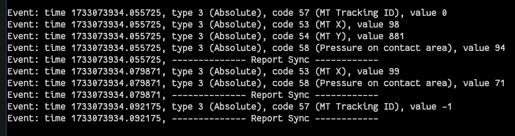
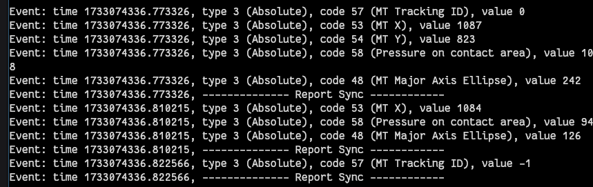

1. Investigate /sys/devices

Potentially I can find something related to Bluetooth there?

2. /dev/input/event0 seems to be where power events go to

3. /dev/input/event1 seems to be where the touch events are going to

Probably can trigger my own right/left tap events from there

Kernel events documentation?

https://docs.kernel.org/input/event-codes.html
